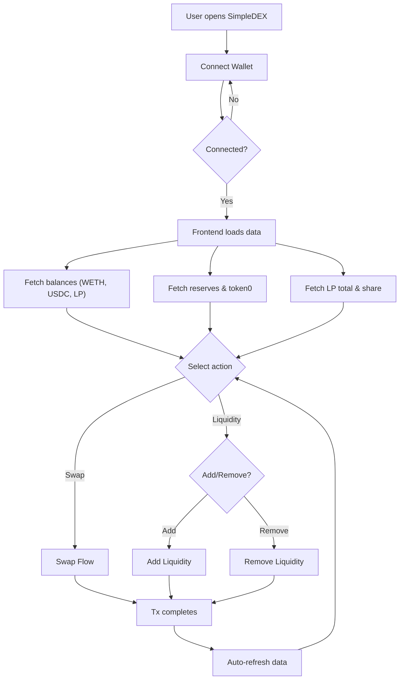
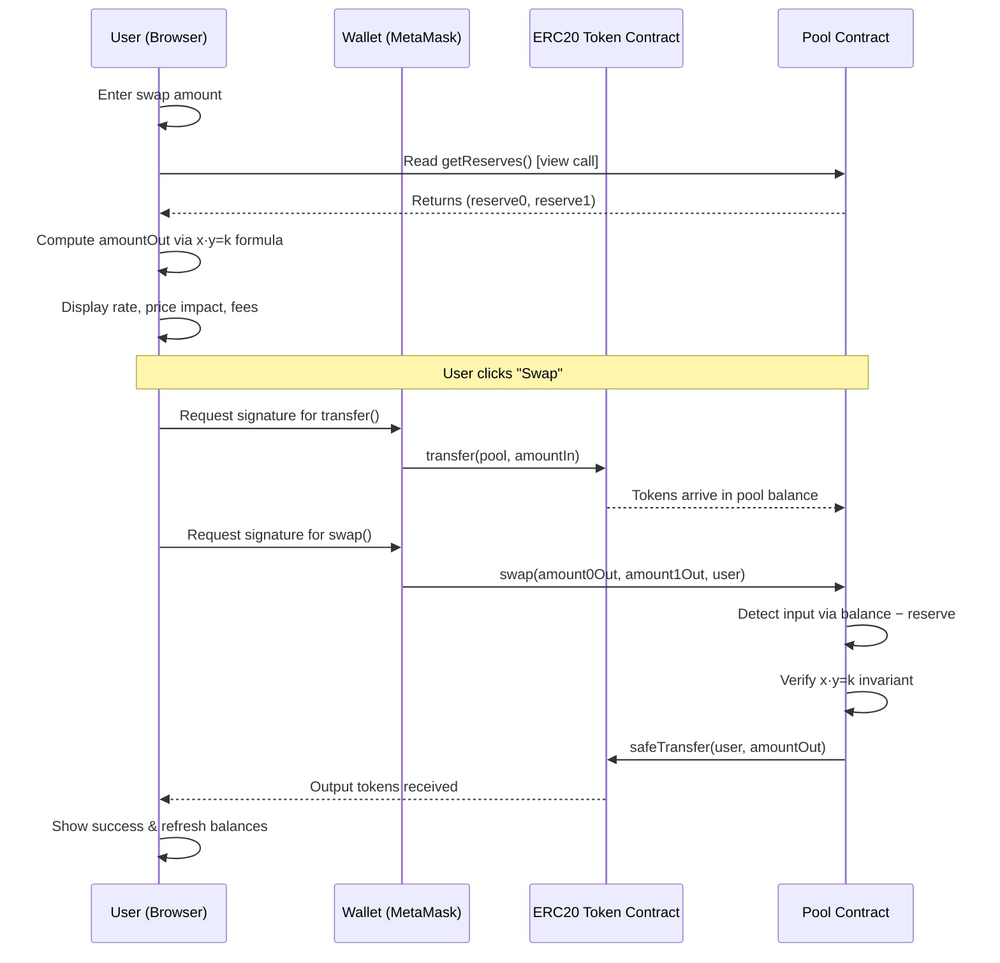
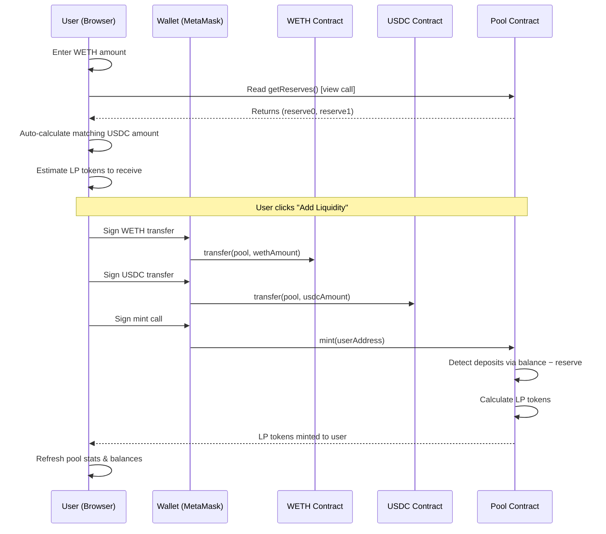
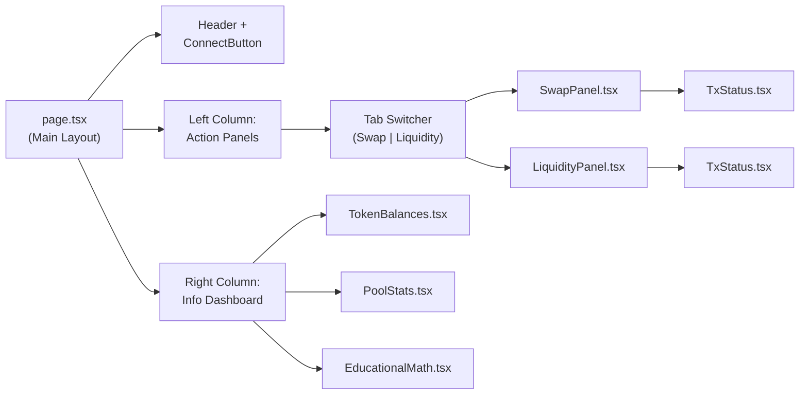
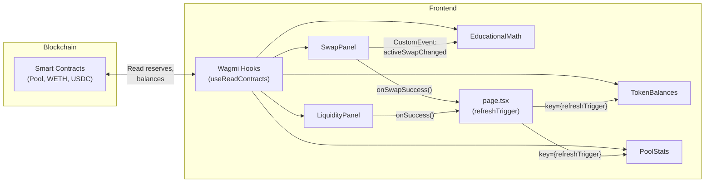

<style>
@import url('https://fonts.googleapis.com/css2?family=Inter:wght@300;400;500;600;700&family=JetBrains+Mono:wght@400;500;600&display=swap');

@page {
  size: A4;
  margin: 25mm 20mm 25mm 20mm;
}

body {
  font-family: 'Inter', -apple-system, BlinkMacSystemFont, "Segoe UI", Roboto, Helvetica, Arial, sans-serif;
  color: #1e293b;
  line-height: 1.6;
  font-size: 11pt;
}

/* Custom cover page layout styling (designed to fit exactly on A4 page 1) */
.cover-page {
  text-align: center;
  padding-top: 1cm;
  padding-bottom: 1cm;
  box-sizing: border-box;
  page-break-after: always;
  break-after: page;
}

.cover-page .university {
  font-size: 15pt;
  font-weight: 700;
  margin-top: 0.5cm;
  margin-bottom: 5px;
  color: #0f172a;
  text-transform: uppercase;
  letter-spacing: 0.5px;
}

.cover-page .school {
  font-size: 11pt;
  font-weight: 600;
  margin-bottom: 2.5cm;
  color: #475569;
  text-transform: uppercase;
  letter-spacing: 0.5px;
}

.cover-page .title-container {
  margin-bottom: 2.5cm;
}

.cover-page .title {
  font-size: 20pt;
  font-weight: 800;
  line-height: 1.3;
  color: #0f172a;
  margin-bottom: 12px;
}

.cover-page .subtitle {
  font-size: 13pt;
  font-weight: 500;
  color: #64748b;
}

.cover-page .meta-container {
  margin-bottom: 2.5cm;
  font-size: 11pt;
  line-height: 1.8;
  color: #1e293b;
}

.cover-page .meta-container p {
  text-align: center;
  margin-bottom: 6px;
}

.cover-page .date-container {
  font-size: 11pt;
  font-weight: 600;
  color: #334155;
  border-top: 1px solid #e2e8f0;
  padding-top: 15px;
  width: 60%;
  margin: 0 auto;
  text-transform: uppercase;
  letter-spacing: 1px;
}

/* Header style rules with automatic page-break-before */
h1, h2, h3, h4 {
  color: #0f172a;
  font-family: 'Inter', sans-serif;
  font-weight: 700;
  page-break-after: avoid;
  break-after: avoid;
}

h1 {
  font-size: 18pt;
  margin-top: 24pt;
  margin-bottom: 12pt;
  border-bottom: 1px solid #e2e8f0;
  padding-bottom: 6pt;
  page-break-before: always;
  break-before: page;
}

h2 {
  font-size: 14pt;
  margin-top: 18pt;
  margin-bottom: 9pt;
}

h3 {
  font-size: 12pt;
  margin-top: 14pt;
  margin-bottom: 6pt;
}

p {
  margin-bottom: 12pt;
  text-align: justify;
}

/* Code & monospace styling */
code {
  font-family: 'JetBrains Mono', 'Courier New', Courier, monospace;
  font-size: 9.5pt;
  background-color: #f1f5f9;
  color: #0f172a;
  padding: 2px 4px;
  border-radius: 4px;
}

pre {
  background-color: #f8fafc;
  border: 1px solid #e2e8f0;
  border-radius: 6px;
  padding: 12pt;
  overflow-x: auto;
  page-break-inside: avoid;
  break-inside: avoid;
  margin-bottom: 16pt;
}

pre code {
  background-color: transparent;
  padding: 0;
  border-radius: 0;
  font-size: 9pt;
  color: #1e293b;
}

/* Table styling for PDF exports */
table {
  width: 100%;
  border-collapse: collapse;
  margin-bottom: 16pt;
  page-break-inside: avoid;
  break-inside: avoid;
}

th, td {
  border: 1px solid #e2e8f0;
  padding: 8pt 12pt;
  text-align: left;
}

th {
  background-color: #f1f5f9;
  color: #0f172a;
  font-weight: 600;
}

tr:nth-child(even) td {
  background-color: #f8fafc;
}

/* Blockquote & custom elements */
blockquote {
  border-left: 4px solid #cbd5e1;
  padding-left: 12pt;
  margin-left: 0;
  margin-right: 0;
  font-style: italic;
  color: #475569;
  page-break-inside: avoid;
  break-inside: avoid;
}

.mermaid {
  margin: 12pt auto;
  text-align: center;
  page-break-inside: avoid;
  break-inside: avoid;
}

/* Keep heading + diagram together on the same page */
.keep-together {
  page-break-inside: avoid;
  break-inside: avoid;
}

/* Prevent orphaned headings at bottom of page */
h3 + p, h3 + .mermaid, h2 + p {
  page-break-before: avoid;
  break-before: avoid;
}

/* Constrain height of large diagrams to fit on one page */
.compact-flow svg {
  max-height: 560px !important;
  width: auto !important;
}
</style>

<div class="cover-page">
  <div class="university">HANOI UNIVERSITY OF SCIENCE AND TECHNOLOGY</div>
  <div class="school">School of Information and Communications Technology</div>
  
  <div class="title-container">
    <div class="title">SimpleDEX: Design, Implementation, and Verification of a Constant Product Automated Market Maker</div>
    <div class="subtitle">Graduation Research 2 Report</div>
  </div>
  
  <div class="meta-container">
    <p><strong>Author:</strong> Vu Anh Tuan (<code>tuan.va194878@sis.hust.edu.vn</code>)</p>
    <p><strong>Program:</strong> Global ICT</p>
    <p><strong>Supervisor:</strong> Dr. Tong Van Van</p>
    <p><strong>Department:</strong> Department of Computer Engineering</p>
  </div>
  
  <div class="date-container">
    HANOI, JUNE 2026
  </div>
</div>

# Table of Contents

- [Abstract](#abstract)
- [1. Introduction and Background](#1-introduction-and-background)
  - [1.1 Decentralized Finance and the Rise of Automated Market Makers](#11-decentralized-finance-and-the-rise-of-automated-market-makers)
  - [1.2 Order Book Systems vs. Liquidity Pools](#12-order-book-systems-vs-liquidity-pools)
  - [1.3 The Constant Product Formula](#13-the-constant-product-formula)
- [2. System Architecture and Smart Contract Design](#2-system-architecture-and-smart-contract-design)
  - [2.1 Architectural Overview](#21-architectural-overview)
  - [2.2 Pool Contract (`Pool.sol`)](#22-pool-contract-poolsol)
    - [2.2.1 ERC20 Inheritance: The Pool Is the LP Token](#221-erc20-inheritance-the-pool-is-the-lp-token)
    - [2.2.2 Storage Packing: `uint112` Reserve Design](#222-storage-packing-uint112-reserve-design)
    - [2.2.3 Security Patterns: CEI and ReentrancyGuard](#223-security-patterns-cei-and-reentrancyguard)
    - [2.2.4 LP Token Minting](#224-lp-token-minting)
    - [2.2.5 LP Token Burning and Pro-Rata Distribution](#225-lp-token-burning-and-pro-rata-distribution)
  - [2.3 Factory Contract (`Factory.sol`)](#23-factory-contract-factorysol)
    - [2.3.1 CREATE2 Deployment](#231-create2-deployment)
    - [2.3.2 Canonical Ordering](#232-canonical-ordering)
    - [2.3.3 Bidirectional Mapping](#233-bidirectional-mapping)
- [3. DeFi Mathematics and Formula Derivations](#3-defi-mathematics-and-formula-derivations)
  - [3.1 Swap Equation Derivation](#31-swap-equation-derivation)
  - [3.2 Solidity Integer Math Implementation](#32-solidity-integer-math-implementation)
  - [3.3 LP Token Equations](#33-lp-token-equations)
- [4. Frontend Architecture and Application Workflow](#4-frontend-architecture-and-application-workflow)
  - [4.1 Technology Stack](#41-technology-stack)
  - [4.2 User Flows and Application Workflow](#42-user-flows-and-application-workflow)
  - [4.3 Component Architecture and Data Flow](#43-component-architecture-and-data-flow)
  - [4.4 DeFi Math Lab Dashboard](#44-defi-math-lab-dashboard)
  - [4.5 Multi-Phase Transaction UX and Multi-Chain Support](#45-multi-phase-transaction-ux-and-multi-chain-support)
- [5. Security and Verification Strategy](#5-security-and-verification-strategy)
  - [5.1 Testing Overview](#51-testing-overview)
  - [5.2 Stateful Invariant Testing](#52-stateful-invariant-testing)
    - [5.2.1 The Handler Pattern](#521-the-handler-pattern)
    - [5.2.2 Core Invariants](#522-core-invariants)
  - [5.3 Vulnerability Mitigations](#53-vulnerability-mitigations)
    - [5.3.1 The Inflation Attack (First-Depositor Front-Running)](#531-the-inflation-attack-first-depositor-front-running)
    - [5.3.2 Static Analysis with Slither](#532-static-analysis-with-slither)
- [6. Conclusion and Future Directions](#6-conclusion-and-future-directions)
  - [6.1 Summary of Contributions](#61-summary-of-contributions)
  - [6.2 Future Extensions](#62-future-extensions)
- [References](#references)

# Abstract

This report presents SimpleDEX, a decentralized exchange protocol implementing a Constant Product Automated Market Maker (CPAMM) on the Ethereum Virtual Machine (EVM). The system comprises two core smart contracts—[Pool.sol](https://github.com/TuanVuNeo/simple-dex/blob/main/src/core/Pool.sol) and [Factory.sol](https://github.com/TuanVuNeo/simple-dex/blob/main/src/core/Factory.sol)—written in Solidity 0.8.28 and built upon the OpenZeppelin v5 library suite. The Pool contract inherits the ERC20 standard, simultaneously functioning as both the AMM liquidity pool and the Liquidity Provider (LP) token, an architectural choice that eliminates a separate token deployment and reduces on-chain overhead. Storage efficiency is achieved through `uint112` packing for reserve variables, fitting two reserves into a single 256-bit EVM storage slot. The protocol enforces a 0.3% swap fee embedded directly into the constant product invariant check.

The verification strategy is comprehensive: 84 test functions spanning unit, fuzz, integration, and reentrancy tests are implemented using the Foundry testing framework. A stateful invariant testing suite employs a Handler pattern to bound fuzz inputs and verify four critical invariants across random operation sequences: constant product growth from fees, balance-reserve integrity, total supply safety, and the permanence of locked minimum liquidity. The inflation attack vector is mitigated by permanently locking 1,000 LP tokens to the `0xdEaD` burn address on the first mint. Static analysis is integrated via Slither.

The accompanying frontend, built with Next.js 16, React 19, Wagmi v2, and RainbowKit v2, is deployed on the Ethereum Sepolia Testnet with multi-chain support for local Anvil development. The web application provides a complete user experience for token swapping and liquidity management, featuring a granular multi-phase transaction tracking system, real-time pool statistics, and an interactive DeFi Math Lab dashboard that renders live mathematical breakdowns of swaps for educational transparency into AMM mechanics.

# 1. Introduction and Background

## 1.1 Decentralized Finance and the Rise of Automated Market Makers

Decentralized Finance (DeFi) represents a paradigm shift from traditional financial intermediation, replacing centralized custodians and order-matching engines with self-executing smart contracts deployed on public blockchains. At the heart of the DeFi trading infrastructure lies the Automated Market Maker (AMM)—an algorithmic mechanism that provides continuous liquidity for token exchanges without the need for a traditional order book or a centralized exchange operator.

The AMM model was pioneered by Bancor (2017) and subsequently refined by Uniswap (2018), which introduced the Constant Product Market Maker (CPMM) formula. The elegance of this approach—a single, permissionless smart contract replacing an entire exchange—has made it the dominant trading mechanism in DeFi, with Uniswap alone processing over $2 trillion in cumulative trading volume.

## 1.2 Order Book Systems vs. Liquidity Pools

Traditional exchanges operate on an **order book** model: buyers and sellers submit limit orders specifying the price and quantity at which they wish to trade, and a matching engine pairs compatible orders. While order books provide precise price discovery and tight spreads for liquid markets, they suffer from significant limitations in decentralized environments:

- **Gas Cost Prohibitiveness**: Each order placement, modification, and cancellation requires an on-chain transaction, imposing gas fees that make high-frequency market-making economically unfeasible on Layer 1 blockchains.
- **Liquidity Fragmentation**: Order book liquidity is fragmented across discrete price levels, and thin order books are vulnerable to manipulation.
- **Bootstrapping Problem**: New trading pairs struggle to attract market makers, creating a cold-start problem.

**Liquidity Pool** AMMs solve these issues by pooling assets from passive liquidity providers into a shared reserve governed by a deterministic pricing function. Any user can deposit tokens into the pool and receive proportional LP tokens representing their share of the pooled assets. Traders swap against the pool reserves, and the pricing function adjusts automatically based on the ratio of assets in the pool. This model provides:

- **Continuous Liquidity**: Trading is always available regardless of the presence of active market makers.
- **Permissionless Participation**: Anyone can become a liquidity provider by depositing tokens.
- **Gas Efficiency**: A single swap requires only one smart contract interaction.

## 1.3 The Constant Product Formula

The Constant Product Market Maker is defined by the invariant:

$$x \cdot y = k$$

where $x$ is the reserve of token A, $y$ is the reserve of token B, and $k$ is a constant that can only increase (due to fee accrual) but never decrease during swaps. This formula produces a convex hyperbolic bonding curve: as a trader removes token B from the pool by adding token A, the marginal price of B increases asymptotically, providing automatic price discovery and continuous liquidity across the entire price range.

The instantaneous spot price of token B in terms of token A is given by the derivative:

$$P_{B/A} = \frac{x}{y}$$

This price adjusts after every swap, with larger trades relative to pool reserves causing greater **price impact**—the deviation between the spot price and the average execution price. This slippage mechanism serves as a natural defense against large manipulative trades and incentivizes arbitrageurs to realign pool prices with external markets.

# 2. System Architecture and Smart Contract Design

## 2.1 Architectural Overview

SimpleDEX follows a two-contract architecture inspired by Uniswap V2:

1. **[Pool.sol](https://github.com/TuanVuNeo/simple-dex/blob/main/src/core/Pool.sol)** — The core AMM contract that manages reserves, executes swaps, mints and burns LP tokens, and enforces the constant product invariant.
2. **[Factory.sol](https://github.com/TuanVuNeo/simple-dex/blob/main/src/core/Factory.sol)** — A factory contract that deploys Pool instances via CREATE2, maintains a registry of all deployed pairs, and enforces canonical token ordering.

Both contracts are compiled with Solidity 0.8.28, leveraging built-in overflow checks, and inherit from the OpenZeppelin v5 library suite for battle-tested ERC20 implementation, `SafeERC20` utilities, `ReentrancyGuard`, `Ownable`, and `Math` functions.

## 2.2 Pool Contract ([Pool.sol](https://github.com/TuanVuNeo/simple-dex/blob/main/src/core/Pool.sol))

### 2.2.1 ERC20 Inheritance: The Pool Is the LP Token

A defining architectural decision is that the Pool contract itself inherits from OpenZeppelin's `ERC20`, making the deployed pool simultaneously the AMM engine and the Liquidity Provider token. This approach, pioneered by Uniswap V2, offers several advantages over deploying a separate LP token contract:

- **Reduced Deployment Cost**: A single contract deployment instead of two saves approximately 1–2 million gas in deployment costs.
- **Atomic State Consistency**: LP token supply and pool reserves are co-located in the same contract, eliminating cross-contract synchronization concerns.
- **Simplified Composability**: External protocols need only interact with a single contract address for both trading and LP token operations.

The LP token name and symbol are dynamically constructed from the constituent token symbols (e.g., `"SimpleDEX WETH-USDC LP"` / `"SLP-WETH-USDC"`), generated via `abi.encodePacked` in the constructor.

### 2.2.2 Storage Packing: `uint112` Reserve Design

The pool's reserve state variables are declared as `uint112` rather than the native `uint256`:

```solidity
uint112 private reserve0;
uint112 private reserve1;
```

This design choice is motivated by two complementary considerations:

1. **Storage Slot Packing**: The EVM allocates storage in 256-bit (32-byte) slots. Two `uint112` values occupy $112 + 112 = 224$ bits, fitting within a single storage slot with 32 bits to spare. Reading both reserves thus requires a single `SLOAD` operation (costing 2,100 gas for a cold read) rather than two. Over millions of swaps, this optimization yields substantial cumulative gas savings.
2. **Overflow Safety in Invariant Checks**: The constant product invariant requires computing $x \cdot y$. With `uint112` reserves, the maximum product is:

$$(\,2^{112} - 1\,)^{2} \approx 2^{224}$$

This fits comfortably within a `uint256` ($2^{256}$), ensuring that invariant verification arithmetic cannot overflow even without explicit checked math for the multiplication itself.

### 2.2.3 Security Patterns: CEI and ReentrancyGuard

All state-changing functions (`mint`, `burn`, `swap`) are protected by the Checks-Effects-Interactions (CEI) pattern and OpenZeppelin's `ReentrancyGuard` (`nonReentrant` modifier):

- **CEI Pattern**: State modifications (effects) are performed before external calls (interactions). In `burn()`, the LP tokens are burned via `_burn(address(this), liquidity)` _before_ executing `safeTransfer` calls to send underlying tokens to the user. This ordering prevents a reentering attacker from exploiting stale state.
- **ReentrancyGuard**: The `nonReentrant` modifier sets a mutex lock upon function entry and releases it upon exit. Any reentrant call within the same transaction reverts, providing defense-in-depth against reentrancy vectors through malicious ERC20 token callbacks (e.g., ERC-777 `tokensReceived` hooks).

### 2.2.4 LP Token Minting

The `mint` function implements a two-regime minting strategy:

**Initial Deposit (First Mint)**:

$$\text{liquidity} = \sqrt{x_0 \cdot y_0} - \text{MINIMUM\_LIQUIDITY}$$

The geometric mean $\sqrt{x \cdot y}$ is chosen over arithmetic alternatives (sum, product, or single-token-weighted) because it provides denomination-invariant fair valuation. If a user deposits $x_0$ units of token A and $y_0$ units of token B, the geometric mean equally weights both contributions regardless of their relative market prices. An arithmetic sum could be manipulated by depositing primarily the cheaper token; the geometric mean is robust against such ratio attacks.

**Subsequent Deposits**:

$$\text{liquidity} = \min\!\left(\frac{\Delta x}{x} \cdot T,\;\frac{\Delta y}{y} \cdot T\right)$$

where $T$ is the current total supply of LP tokens, $x$ and $y$ are the existing reserves, and $\Delta x$, $\Delta y$ are the deposited amounts. The `min` function protects existing liquidity providers: if a depositor provides tokens in a ratio different from the current pool ratio, they receive LP tokens proportional to the _lesser_ side. The excess tokens are effectively donated to the pool, benefiting existing LPs. This mechanism disincentivizes imbalanced deposits that would shift the pool's price.

### 2.2.5 LP Token Burning and Pro-Rata Distribution

The `burn` function calculates withdrawal amounts using pro-rata distribution:

$$\text{amount}_0 = \frac{\text{liquidity} \cdot \text{balance}_0}{\text{totalSupply}}$$

$$\text{amount}_1 = \frac{\text{liquidity} \cdot \text{balance}_1}{\text{totalSupply}}$$

Solidity integer division inherently rounds down, which favors the pool over the withdrawer. This rounding behavior is not incidental but deliberate: it prevents **dust drain attacks** where an attacker could make many small withdrawals, exploiting rounding in their favor to extract more value than their proportional share. Over thousands of micro-withdrawals, the accumulated rounding error would drain pool reserves; rounding down ensures each withdrawal leaves the pool marginally better off.

## 2.3 Factory Contract ([Factory.sol](https://github.com/TuanVuNeo/simple-dex/blob/main/src/core/Factory.sol))

The Factory contract inherits OpenZeppelin's `Ownable`, restricting pool creation to the contract deployer via the `onlyOwner` modifier. This is a deliberate simplification for an educational project; production DEXes such as Uniswap employ permissionless pool creation. The `Ownable` pattern prevents unauthorized users from deploying arbitrary token pairs, providing a controlled environment for testing and demonstration.

### 2.3.1 CREATE2 Deployment

The Factory deploys new Pool contracts using the EVM's `CREATE2` opcode via inline assembly:

```solidity
bytes memory bytecode = abi.encodePacked(
    type(Pool).creationCode,
    abi.encode(token0, token1)
);
bytes32 salt = keccak256(abi.encodePacked(token0, token1));

assembly {
    pool := create2(0, add(bytecode, 32), mload(bytecode), salt)
}
```

The `create2` instruction takes four arguments: value to send (0 ETH), pointer to the bytecode in memory (`add(bytecode, 32)` skips the length prefix of `bytes`), length of the bytecode (`mload(bytecode)` reads the first 32 bytes which store the length), and a salt. The resulting contract address is deterministically computed as:

$$\text{address} = \text{keccak256}(\texttt{0xff} \;\|\; \text{factory\_address} \;\|\; \text{salt} \;\|\; \text{keccak256}(\text{init\_code}))$$

This determinism provides three key benefits:

1. **Off-Chain Address Prediction**: Frontends and integrating contracts can compute a pool's address without querying the blockchain, enabling gasless pool discovery.
2. **Duplicate Prevention**: Attempting to deploy with the same salt to the same address is guaranteed to fail, inherently preventing duplicate pools for the same token pair.
3. **Cross-Chain Consistency**: Deploying the same factory on multiple chains produces the same pool addresses for the same token pairs.

### 2.3.2 Canonical Ordering

Before deployment, the Factory sorts the input token addresses to establish a canonical pair:

```solidity
(address token0, address token1) = tokenA < tokenB
    ? (tokenA, tokenB)
    : (tokenB, tokenA);
```

This sorting ensures that `createPool(A, B)` and `createPool(B, A)` produce identical salts and therefore identical addresses. Without canonical ordering, each permutation would generate a distinct salt, allowing two separate pools for the same economic pair—fragmenting liquidity and creating arbitrage-exploitable price discrepancies.

### 2.3.3 Bidirectional Mapping

After deployment, the Factory registers the pool in both directions:

```solidity
getPair[token0][token1] = pool;
getPair[token1][token0] = pool;
```

This convenience pattern allows callers to look up a pool with tokens in any order (`getPair[A][B]` or `getPair[B][A]`) without needing to pre-sort addresses. The storage cost of one additional `SSTORE` (~20,000 gas) at deployment time is amortized over all future lookups that avoid an off-chain sorting step.

# 3. DeFi Mathematics and Formula Derivations

## 3.1 Swap Equation Derivation

Given the constant product invariant with a 0.3% fee, we derive the output amount $\Delta y$ for a given input $\Delta x$:

**Starting invariant** (after fee deduction from input):

$$(x + \Delta x \cdot 0.997) \cdot (y - \Delta y) = x \cdot y$$

**Step 1** — Expand the left side:

$$x \cdot y - x \cdot \Delta y + \Delta x \cdot 0.997 \cdot y - \Delta x \cdot 0.997 \cdot \Delta y = x \cdot y$$

**Step 2** — Subtract $x \cdot y$ from both sides:

$$-x \cdot \Delta y + \Delta x \cdot 0.997 \cdot y - \Delta x \cdot 0.997 \cdot \Delta y = 0$$

**Step 3** — Isolate $\Delta y$:

$$\Delta x \cdot 0.997 \cdot y = \Delta y \cdot (x + \Delta x \cdot 0.997)$$

**Step 4** — Solve for $\Delta y$:

$$\boxed{\Delta y = \frac{\Delta x \cdot 0.997 \cdot y}{x + \Delta x \cdot 0.997}}$$

## 3.2 Solidity Integer Math Implementation

Floating-point arithmetic is unavailable in the EVM. The contract implements the above formula using integer-only operations by scaling the 0.997 factor:

$$0.997 = \frac{997}{1000}$$

Substituting into the formula and simplifying:

$$\Delta y = \frac{\Delta x \cdot 997 \cdot y}{x \cdot 1000 + \Delta x \cdot 997}$$

The corresponding Solidity implementation in `getAmountOut()`:

```solidity
uint256 amountInWithFee = amountIn * 997;
uint256 numerator = amountInWithFee * reserveOut;
uint256 denominator = reserveIn * 1000 + amountInWithFee;
amountOut = numerator / denominator;
```

The integer division in the final step rounds down, ensuring the pool always retains at least as much value as the invariant requires—the contract never overpays the trader.

## 3.3 LP Token Equations

### Initial Minting

$$L_{\text{initial}} = \sqrt{\Delta x \cdot \Delta y} - 1000$$

where 1000 is the `MINIMUM_LIQUIDITY` permanently locked to the dead address. The square root is computed via OpenZeppelin's `Math.sqrt()`, which uses the Babylonian method (a special case of Newton-Raphson iteration applied to $f(x) = x^2 - a$) with a bit-level initial estimate for rapid convergence in six fixed iterations.

### Subsequent Minting

$$L = \min\!\left(\frac{\Delta x}{x} \cdot T,\;\frac{\Delta y}{y} \cdot T\right)$$

where $T$ is the current total supply. This formula ensures that LP tokens are issued proportionally to the smaller of the two deposit ratios, preventing dilution attacks.

### Burning (Withdrawal)

$$\text{amount}_i = \frac{L_{\text{burned}}}{T} \cdot \text{balance}_i \quad \text{for } i \in \{0, 1\}$$

# 4. Frontend Architecture and Application Workflow

## 4.1 Technology Stack

The SimpleDEX frontend is built on a modern React-based stack:

| Layer                 | Technology     | Version | Role                                              |
| :-------------------- | :------------- | :------ | :------------------------------------------------ |
| **Framework**         | Next.js        | 16.1.6  | Server/client rendering, routing                  |
| **UI Library**        | React          | 19.2.3  | Component architecture with React Compiler        |
| **Styling**           | Tailwind CSS   | 4.x     | Utility-first CSS framework                       |
| **Wallet Connection** | RainbowKit     | 2.2.10  | Wallet modal & multi-wallet support               |
| **Blockchain Hooks**  | Wagmi          | 2.19.5  | React hooks for Ethereum interactions             |
| **EVM Client**        | viem           | 2.46.3  | TypeScript EVM client (ABI encoding, tx crafting) |
| **State Management**  | TanStack Query | 5.90.21 | Caching, refetching, and synchronization          |

## 4.2 User Flows and Application Workflow

The SimpleDEX web application provides three primary user flows: **swapping tokens**, **adding liquidity**, and **removing liquidity**. Each flow guides the user through a series of wallet interactions with real-time feedback at every stage.

<div class="keep-together compact-flow">

### 4.2.1 End-to-End Application Flow

The following diagram illustrates the complete lifecycle of a user interaction with SimpleDEX, from wallet connection through transaction execution:



</div>

### 4.2.2 Swap Token Flow

The swap flow is the most common user interaction. The user selects an input token (WETH or USDC), enters an amount, and the application computes the expected output in real time before submitting the transaction.

**Step-by-step process:**

1. **Select Input Token** — The user clicks the token selector to choose between WETH and USDC as the input token. The output token is automatically set to the other token in the pair.
2. **Enter Amount** — As the user types an input amount, the frontend reads the current pool reserves from the smart contract and applies the constant product formula to compute the expected output amount, price impact, LP fee, and minimum received (accounting for slippage tolerance).
3. **Review Trade Details** — A real-time summary panel displays:
   - **Exchange Rate**: The effective rate for this specific trade size.
   - **Price Impact**: The percentage deviation from the spot price caused by the trade size relative to pool reserves.
   - **LP Fee**: The 0.3% fee deducted from the input amount.
   - **Minimum Received**: The worst-case output after applying the user's slippage tolerance.
4. **Submit Swap** — The user clicks "Swap" and signs two sequential wallet transactions:
   - **Transaction 1 — Token Transfer**: The input tokens are transferred to the Pool contract address.
   - **Transaction 2 — Execute Swap**: The Pool's `swap()` function is called, which detects the deposited tokens, verifies the constant product invariant, and sends the output tokens to the user.
5. **Confirmation** — The UI displays a success banner with a link to the block explorer for each transaction.



### 4.2.3 Add Liquidity Flow

Liquidity providers deposit both WETH and USDC into the pool in exchange for LP tokens that represent their proportional share of the pool.

**Step-by-step process:**

1. **Enter Deposit Amounts** — The user enters the WETH amount to deposit. If the pool already has liquidity, the required USDC amount is automatically calculated to match the current pool ratio (maintaining the price). For the first deposit (pool initialization), the user sets both amounts freely, which establishes the initial exchange rate.
2. **Review LP Token Estimate** — The UI displays the estimated LP tokens the user will receive, computed using the minting formula: $L = \min(\frac{\Delta x}{x} \cdot T,\;\frac{\Delta y}{y} \cdot T)$ for subsequent deposits, or $L = \sqrt{\Delta x \cdot \Delta y} - 1000$ for the initial deposit.
3. **Submit Liquidity** — The user clicks "Add Liquidity" and signs three sequential wallet transactions:
   - **Transaction 1 — Transfer WETH**: WETH tokens are sent to the Pool contract.
   - **Transaction 2 — Transfer USDC**: USDC tokens are sent to the Pool contract.
   - **Transaction 3 — Mint LP Tokens**: The Pool's `mint()` function is called, which detects the deposited tokens, calculates the LP tokens to issue, and mints them to the user's address.
4. **Confirmation** — The UI refreshes pool statistics, showing the updated reserves, the user's new LP token balance, and their pool share percentage.



### 4.2.4 Remove Liquidity Flow

Liquidity providers withdraw their position by burning LP tokens in exchange for a proportional share of the pool's underlying WETH and USDC reserves.

**Step-by-step process:**

1. **Enter LP Amount** — The user enters the number of LP tokens to burn, or uses the percentage slider (25%, 50%, 75%, 100%) for convenience. The UI immediately calculates the WETH and USDC amounts the user will receive based on the pro-rata withdrawal formula.
2. **Review Withdrawal Estimate** — The UI displays the expected WETH and USDC amounts: $\text{amount}_i = \frac{L_{\text{burned}}}{T} \cdot \text{balance}_i$.
3. **Submit Withdrawal** — The user clicks "Remove Liquidity" and signs two sequential wallet transactions:
   - **Transaction 1 — Transfer LP Tokens**: LP tokens are sent to the Pool contract address.
   - **Transaction 2 — Burn LP Tokens**: The Pool's `burn()` function is called, which destroys the received LP tokens and sends the proportional WETH and USDC back to the user.
4. **Confirmation** — The UI refreshes, showing updated balances and pool statistics.

<div class="keep-together">

## 4.3 Component Architecture and Data Flow

The SimpleDEX frontend follows a component-based architecture where each component has a clearly defined responsibility. The main application page ([page.tsx](https://github.com/TuanVuNeo/simple-dex/blob/main/frontend/app/page.tsx)) orchestrates the layout and coordinates data refresh across components.

### 4.3.1 Component Hierarchy



</div>

### 4.3.2 Component Responsibilities

| Component           | File                  | Responsibility                                                                                          |
| :------------------ | :-------------------- | :------------------------------------------------------------------------------------------------------ |
| **ConnectButton**   | `ConnectButton.tsx`   | Renders RainbowKit's wallet connection modal, handles wallet connect/disconnect                         |
| **SwapPanel**       | `SwapPanel.tsx`       | Token swap form: input/output amounts, token selection, rate calculation, multi-phase swap execution    |
| **LiquidityPanel**  | `LiquidityPanel.tsx`  | Dual-tab panel for adding and removing liquidity, LP token estimates, multi-phase transaction execution |
| **TokenBalances**   | `TokenBalances.tsx`   | Displays user's WETH, USDC, and LP token balances by reading on-chain ERC20 `balanceOf`                 |
| **PoolStats**       | `PoolStats.tsx`       | Shows pool reserves, exchange rate, total LP supply, and user's pool share percentage                   |
| **EducationalMath** | `EducationalMath.tsx` | Interactive DeFi Math Lab: live $x \cdot y = k$ invariant display and real-time swap math breakdown     |
| **TxStatus**        | `TxStatus.tsx`        | Reusable transaction status banner with phase labels, spinner animations, and block explorer links      |

### 4.3.3 Data Flow and State Management

The application uses a combination of Wagmi React hooks and React state to manage data flow between the blockchain and UI components:

1. **On-Chain Reads (Wagmi `useReadContracts`)**: Each component independently reads the smart contract data it needs (reserves, balances, total supply) using Wagmi's `useReadContracts` hook with a 5-second polling interval. This ensures all displayed data stays current without manual refresh.

2. **Cross-Component Refresh (`refreshTrigger`)**: The main `page.tsx` maintains a `refreshTrigger` counter. When any action panel completes a transaction (swap, add liquidity, remove liquidity), it calls the `onSwapSuccess` / `onSuccess` callback, which increments `refreshTrigger`. This counter is passed as a React `key` to the dashboard components, forcing them to remount and re-fetch fresh on-chain data.

3. **Cross-Component Events (`CustomEvent`)**: The `SwapPanel` dispatches a browser `CustomEvent` named `activeSwapChanged` whenever the user's input changes. The `EducationalMath` component listens for this event and updates its live math breakdown in real time, creating a synchronized educational experience without tightly coupling the two components.

4. **Transaction State Machines (`TxPhase`)**: Each action panel (`SwapPanel`, `LiquidityPanel`) manages its own typed state machine (`TxPhase`) that tracks the current stage of the multi-step transaction flow. The state machine drives both the action button label and the `TxStatus` banner, ensuring the user always knows which wallet signature is required next.

<div class="keep-together">



</div>

## 4.4 DeFi Math Lab Dashboard

The [EducationalMath.tsx](https://github.com/TuanVuNeo/simple-dex/blob/main/frontend/components/EducationalMath.tsx) component implements an interactive, real-time mathematical dashboard that exposes the AMM mechanics to the user. To match the exact mathematical execution of the Solidity contracts, the dashboard displays reserve and calculation parameters in high-precision values (8 decimals for WETH, 6 decimals for USDC, and full decimal precision for LP supply). It consists of two primary sections:

1. **Live Invariant Display**: Reads on-chain reserves via `useReadContracts` (with 5-second polling) and computes the live $k$ value, displaying the complete equation $x_{\text{WETH}} \times y_{\text{USDC}} = k$ with high-precision numerical values.
2. **Dynamic Trade Breakdown**: Listens for `CustomEvent` dispatches from the `SwapPanel` component (via `window.addEventListener('activeSwapChanged', ...)`) and renders a step-by-step mathematical decomposition of the currently entered swap:
   - **Step 1: Fee deduction** — shows $\Delta x_{\text{eff}} = \Delta x \times 0.997$ with scaled computed values.
   - **Step 2: Invariant application** — renders the full formula $\Delta y = \frac{\Delta x_{\text{eff}} \cdot y}{x + \Delta x_{\text{eff}}}$ with substituted high-precision reserve values.

This component serves the educational mission of the project: students and learners can observe how each input amount propagates through the mathematical formulas and maps to on-chain operations.

## 4.5 Multi-Phase Transaction UX and Multi-Chain Support

To support both live testnet deployment and local development verification, the frontend implements a multi-chain architecture alongside granular transaction status feedback.

### 4.5.1 Multi-Chain Configuration & Sepolia Deployment

The smart contracts are deployed and verified on the Ethereum Sepolia Testnet using Foundry's `forge script` with Etherscan verification. The Wagmi configuration ([wagmi.ts](https://github.com/TuanVuNeo/simple-dex/blob/main/frontend/lib/wagmi.ts)) registers both `sepolia` (via Alchemy RPC) and a custom `localAnvil` chain definition (chain ID 31338), allowing developers to seamlessly switch between live and local environments. Environment-specific contract addresses and explorer endpoints are configured via `frontend/.env.local`, decoupling deployment targets from application code.

### 4.5.2 Granular Multi-Phase Transaction Flow

Because the direct transfer pattern requires multiple sequential on-chain transactions, the user interface provides precise, phase-by-phase status feedback. Each panel implements a typed state machine (`TxPhase`) that tracks the exact stage of execution:

**SwapPanel** (2 transactions: `transfer` → `swap`):

- `approve-pending` → `approve-confirming`: The user signs the ERC20 `transfer` in their wallet; the frontend awaits block confirmation.
- `swap-pending` → `swap-confirming`: The user signs the Pool's `swap` call; the frontend awaits the swap receipt.
- `success`: Displays a confirmation banner that auto-clears after 5 seconds.

**LiquidityPanel — Add Liquidity** (3 transactions: `transfer WETH` → `transfer USDC` → `mint`):

- `weth-pending` → `weth-confirming`: WETH transfer to the Pool.
- `usdc-pending` → `usdc-confirming`: USDC transfer to the Pool.
- `mint-pending` → `mint-confirming`: LP token minting via `pool.mint(to)`.

**LiquidityPanel — Remove Liquidity** (2 transactions: `transfer LP` → `burn`):

- `lp-transfer-pending` → `lp-transfer-confirming`: LP token transfer to the Pool.
- `burn-pending` → `burn-confirming`: Asset withdrawal via `pool.burn(to)`.

Each phase transition updates both the action button label and a dedicated status banner, ensuring users always know which wallet signature is required and which on-chain confirmation is pending.

### 4.5.3 Dynamic Block Explorer Integration

The `TxStatus` component ([TxStatus.tsx](https://github.com/TuanVuNeo/simple-dex/blob/main/frontend/components/TxStatus.tsx)) dynamically resolves block explorer URLs using the `getExplorerTxLink` helper in [constants.ts](https://github.com/TuanVuNeo/simple-dex/blob/main/frontend/lib/constants.ts). The base URL is configured via the `NEXT_PUBLIC_EXPLORER_URL` environment variable—defaulting to `http://localhost:5100` for local Otterscan instances and overridden to `https://sepolia.etherscan.io` on Sepolia. This provides users with direct, verifiable links to every submitted transaction.

# 5. Security and Verification Strategy

## 5.1 Testing Overview

SimpleDEX employs a multi-layered verification strategy implemented entirely within the Foundry testing framework. The test suite comprises **84 test functions** across 8 test files:

| Test File                                                                                                    | Category    | Description                                        |
| :----------------------------------------------------------------------------------------------------------- | :---------- | :------------------------------------------------- |
| **[Pool.t.sol](https://github.com/TuanVuNeo/simple-dex/blob/main/test/core/Pool.t.sol)**                     | Unit        | Core pool operations: mint, burn, swap, edge cases |
| **[Factory.t.sol](https://github.com/TuanVuNeo/simple-dex/blob/main/test/core/Factory.t.sol)**               | Unit        | Factory deployment, CREATE2, pair registry         |
| **[PoolFuzz.t.sol](https://github.com/TuanVuNeo/simple-dex/blob/main/test/core/PoolFuzz.t.sol)**             | Fuzz        | Property-based testing with randomized inputs      |
| **[PoolInvariant.t.sol](https://github.com/TuanVuNeo/simple-dex/blob/main/test/core/PoolInvariant.t.sol)**   | Invariant   | Stateful invariant testing with handler pattern    |
| **[PoolReentrancy.t.sol](https://github.com/TuanVuNeo/simple-dex/blob/main/test/core/PoolReentrancy.t.sol)** | Security    | Reentrancy attack simulations                      |
| **[Integration.t.sol](https://github.com/TuanVuNeo/simple-dex/blob/main/test/core/Integration.t.sol)**       | Integration | End-to-end multi-contract workflows                |
| **[WETH.t.sol](https://github.com/TuanVuNeo/simple-dex/blob/main/test/tokens/WETH.t.sol)**                   | Unit        | WETH token-specific behavior                       |
| **[MockUSDC.t.sol](https://github.com/TuanVuNeo/simple-dex/blob/main/test/tokens/MockUSDC.t.sol)**           | Unit        | Mock USDC token-specific behavior                  |

## 5.2 Stateful Invariant Testing

The invariant testing suite ([PoolInvariant.t.sol](https://github.com/TuanVuNeo/simple-dex/blob/main/test/core/PoolInvariant.t.sol)) represents the most sophisticated verification layer, employing Foundry's stateful fuzzing engine to explore random sequences of pool operations over hundreds of iterations.

### 5.2.1 The Handler Pattern

The `PoolHandler` contract acts as an intermediary between Foundry's fuzzer and the Pool contract, serving two critical purposes:

1. **Input Bounding**: Raw fuzz values are constrained to economically valid ranges using Foundry's `bound()` function. For example, swap amounts are bounded between `1e6` and half of the current reserve (`uint256(r0) / 2`), ensuring inputs are non-trivial yet cannot drain the pool in a single operation. Liquidity additions are bounded between `1e6` and `1e24`.
2. **State Management**: The handler tracks a `kBaseline` variable representing the last known valid $k$ value. This baseline is updated after `mint` and `burn` operations (which legitimately change $k$) but _not_ after swaps, enabling the invariant test to specifically verify that swap fees strictly increase $k$.

The Foundry configuration restricts the fuzzer to only call the four handler functions (`addLiquidity`, `swapToken0ForToken1`, `swapToken1ForToken0`, `removeLiquidity`), excluding `initKBaseline` from fuzz targets via explicit selector filtering.

### 5.2.2 Core Invariants

Four invariants are verified across all random operation sequences:

**Invariant 1 — Constant Product Growth** (`invariant_constant_product_never_decreases`):

$$k_{\text{current}} \geq k_{\text{baseline}}$$

After any sequence of swaps (without intervening mints or burns), the reserve product must be greater than or equal to the recorded baseline. This verifies that the 0.3% swap fee strictly increases $k$, ensuring LPs always accrue value. The baseline is reset after mints/burns, which legitimately alter reserves.

**Invariant 2 — Balance Integrity** (`invariant_reserves_match_token_balances`):

$$\text{balanceOf}(\text{pool}) \geq \text{reserve}_i \quad \text{for } i \in \{0, 1\}$$

The actual ERC20 token balance held by the pool contract must always be greater than or equal to the stored reserve values. Reserves may lag behind actual balances (e.g., if someone donates tokens to the pool directly), but must never exceed them. A violation would indicate a critical accounting error.

**Invariant 3 — Total Supply Safety** (`invariant_total_supply_greater_than_minimum_liquidity`):

$$\text{totalSupply} \geq 1000$$

After the first mint, the total supply of LP tokens must always be at least `MINIMUM_LIQUIDITY` (1,000). This invariant ensures that the locked liquidity is never burned and that the pool cannot be drained to a state where the MINIMUM_LIQUIDITY is lost.

**Invariant 4 — LP Burn Lock** (`invariant_dead_address_always_holds_minimum_liquidity`):

$$\text{balanceOf}(\texttt{0xdEaD}) = 1000$$

The dead address must hold exactly 1,000 LP tokens at all times. This verifies that no operation can transfer, burn, or otherwise remove the locked minimum liquidity, preserving the inflation attack mitigation permanently.

## 5.3 Vulnerability Mitigations

### 5.3.1 The Inflation Attack (First-Depositor Front-Running)

The inflation attack (also known as the "donation attack" or "vault inflation exploit") targets the first deposit of an AMM pool or ERC4626 vault. The attack proceeds as follows:

1. An attacker observes a pending first liquidity deposit in the mempool.
2. The attacker front-runs by depositing a minimal amount (e.g., 1 wei of each token), receiving a small number of LP tokens.
3. The attacker directly transfers (donates) a large quantity of tokens to the pool contract, inflating the value per LP token.
4. When the victim's deposit executes, the LP token calculation yields 0 tokens due to integer rounding (the denominator has grown enormously while the numerator remains small).
5. The attacker burns their LP tokens and withdraws both their donated tokens and the victim's deposit.

**SimpleDEX's Mitigation**: On the first `mint`, the pool permanently locks `MINIMUM_LIQUIDITY = 1000` LP tokens by minting them to `address(0xdEaD)`:

```solidity
_mint(DEAD_ADDRESS, MINIMUM_LIQUIDITY);
```

This lock ensures that the total supply of LP tokens can never be reduced to near-zero values, making the rounding manipulation economically infeasible. To steal significant value, an attacker would need to donate tokens disproportionate to their potential gain, as the locked 1,000 tokens maintain a meaningful baseline for the LP-to-reserve ratio.

**Why `0xdEaD` instead of `address(0)`?** OpenZeppelin's ERC20 implementation (v5) explicitly rejects `_mint` and `_transfer` calls to `address(0)`, reverting with an `ERC20InvalidReceiver` error. The conventional dead address `0x000000000000000000000000000000000000dEaD` is used as an alternative burn address—tokens sent there are irrecoverable since no one controls the private key for this address.

### 5.3.2 Static Analysis with Slither

The codebase is integrated with **Slither**, Trail of Bits' static analysis framework for Solidity. Slither performs automated vulnerability detection covering:

- Reentrancy pattern detection
- Unchecked external calls
- State variable shadowing
- Unused return values
- Dangerous strict equality checks
- Access control misconfigurations

# 6. Conclusion and Future Directions

## 6.1 Summary of Contributions

SimpleDEX demonstrates a complete, end-to-end implementation of a Constant Product Automated Market Maker—from mathematical foundations through smart contract engineering to frontend integration—with an emphasis on educational clarity and engineering rigor. The key contributions of this project are:

1. **Precision-Safe Integer Arithmetic**: The absence of floating-point types in the EVM necessitates careful formula transformation. The conversion of $0.997$ to $\frac{997}{1000}$ and the consistent use of multiplication-before-division ordering to minimize truncation error are fundamental EVM development patterns. The deliberate choice to round down in all calculations (favoring the pool over the user) is a security invariant, not an implementation detail.
2. **Defense-in-Depth Against Reentrancy**: The combination of the Checks-Effects-Interactions pattern with `ReentrancyGuard` provides layered protection. The CEI pattern alone is insufficient against sophisticated attacks involving multiple contract interactions or malicious ERC-777 token callbacks; the mutex lock provides a definitive second barrier.
3. **Complete Full-Stack Application**: Beyond the smart contract layer, the project delivers a fully functional web application with clearly defined user flows for swapping, adding liquidity, and removing liquidity. The component-based architecture with cross-component data flow patterns (refresh triggers, custom events, typed state machines) demonstrates production-grade frontend engineering integrated with blockchain interactions.
4. **Invariant Testing as a Verification Paradigm**: Traditional unit tests verify specific scenarios; invariant testing verifies properties that must hold across _all possible_ sequences of operations. The handler pattern for input bounding and baseline management is a powerful technique for making stateful invariant testing tractable, and the 84-test suite provides strong confidence in correctness.
5. **Full-Stack Testnet Deployment**: The project bridges the gap between academic smart contract development and practical deployment by providing a fully functional frontend deployed on Sepolia, with multi-phase transaction tracking and educational mathematical visualization.

## 6.2 Future Extensions

Several natural extensions would advance SimpleDEX toward production readiness:

1. **Time-Weighted Average Price (TWAP) Oracles**: Accumulating `price0CumulativeLast` and `price1CumulativeLast` values in the `_update` function (as Uniswap V2 does) would enable manipulation-resistant on-chain price feeds. The TWAP is computed as the difference between two cumulative price snapshots divided by the elapsed time, making it costly for attackers to sustain price manipulation across multiple blocks.
2. **Concentrated Liquidity**: Following the Uniswap V3 paradigm, allowing LPs to concentrate their liquidity within specific price ranges $[p_a, p_b]$ would dramatically improve capital efficiency. This requires replacing the constant product curve with piecewise virtual reserves and introduces NFT-based LP positions.
3. **Multi-Asset Pools**: Extending beyond two-token pairs to support pools with $n$ assets, governed by a generalized invariant such as Balancer's weighted geometric mean: $\prod_{i=1}^{n} B_i^{w_i} = k$.
4. **Flash Swaps**: Allowing users to receive output tokens before providing input would enable atomic arbitrage within a single transaction, a powerful DeFi primitive for MEV and cross-protocol composability.
5. **Governance and Fee Tiers**: Introducing configurable fee parameters (e.g., 0.05%, 0.3%, 1%) controlled by on-chain governance would allow market-driven fee optimization for different asset pair volatility profiles.
6. **Permissionless Pool Creation**: Removing the `Ownable` restriction on the Factory contract would allow any user to deploy pools for arbitrary token pairs, matching the permissionless ethos of production DeFi protocols.

# References

1. Adams, H. (2018). _Uniswap Whitepaper_. [hackmd.io/@HaydenAdams/HJ9jLsfTz](https://hackmd.io/@HaydenAdams/HJ9jLsfTz)
2. Adams, H., Zinsmeister, N., & Robinson, D. (2020). _Uniswap v2 Core_. [uniswap.org/whitepaper.pdf](https://uniswap.org/whitepaper.pdf)
3. Adams, H., Zinsmeister, N., Salem, M., Keefer, R., & Robinson, D. (2021). _Uniswap v3 Core_. [uniswap.org/whitepaper-v3.pdf](https://uniswap.org/whitepaper-v3.pdf)
4. OpenZeppelin. (2025). _OpenZeppelin Contracts v5.x Documentation_. [docs.openzeppelin.com/contracts/5.x](https://docs.openzeppelin.com/contracts/5.x/)
5. Paradigm. (2025). _Foundry Book: Invariant Testing_. [book.getfoundry.sh/forge/invariant-testing](https://book.getfoundry.sh/forge/invariant-testing)
6. Trail of Bits. (2025). _Slither: Solidity Static Analysis Framework_. [github.com/crytic/slither](https://github.com/crytic/slither)
7. Buterin, V. (2018). _Improving front running resistance of x·y=k market makers_. [ethresear.ch/t/improving-front-running-resistance-of-x-y-k-market-makers/1281](https://ethresear.ch/t/improving-front-running-resistance-of-x-y-k-market-makers/1281)
8. Martinelli, F., & Mushegian, N. (2019). _Balancer Whitepaper_. [balancer.fi/whitepaper.pdf](https://balancer.fi/whitepaper.pdf)
9. Ethereum Foundation. (2025). _Ethereum Yellow Paper: Ethereum Virtual Machine Specification_. [ethereum.github.io/yellowpaper](https://ethereum.github.io/yellowpaper/paper.pdf)
